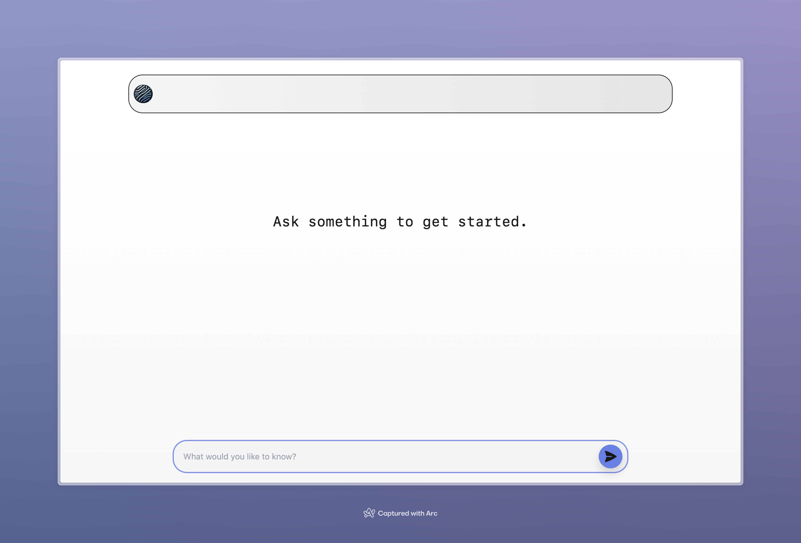
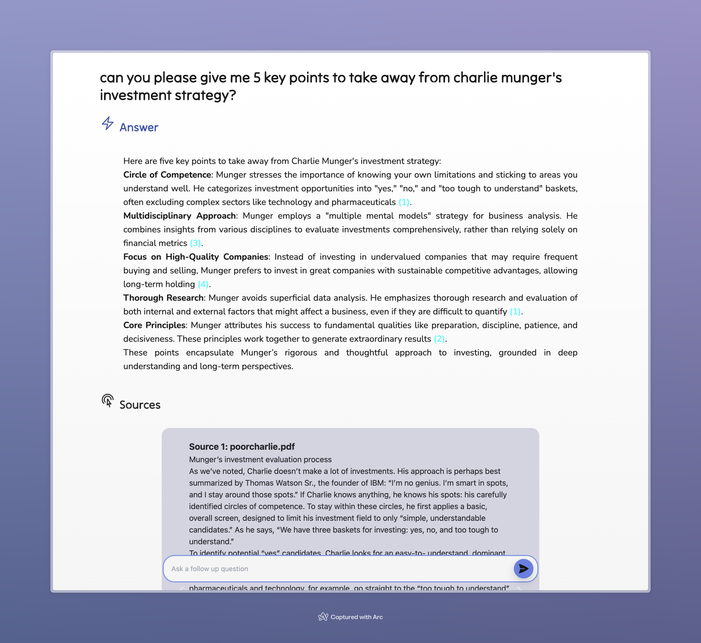
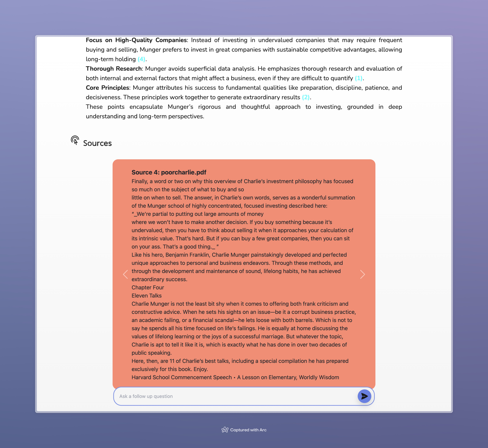

# Template OneContext / NextJS / Vercel AI WebApp

## What is this?

A WebApp, built with the NextJS framework, that leverages both [Vercel AI](https://github.com/vercel/ai) and [
OneContext](https://docs.onecontext.ai) to augment the entire application (both server and client side) with an `AI
Provider` which has both:
- (a) the most recent history of all the interactions between your user and your model.
- (b) the most relevant context for the particular user and the particular interaction with the model (with the context coming from OneContext)

## What can I do with it?

You can create up a WebApp that looks vaguely similar to apps like [Perplexity](https://perplexity.ai)
and [You](https://you.com), with a chat interface, streaming responses, and which lets users "chat" with any corpus of
information you can host in a OneContext knowledge base.

For example:

First upload a directory of files about Charlie Munger to a knowledge base:
```zsh
onecli knowledge-base upload directory --knowledge-base-name=demo_kb --metadata-json='{"tag": "charlie_munger"}'
```

Now just run the app, and ask it questions. The responses will be based on the most relevant data across all the documents / books you uploaded. The sources will be cited, where and when they are used.

### A simple landing page


### Ask a question and get an answer back grounded in the context from your knowledge base


### Click on a citation to dig into the particular source



## How to use it in your app

### What you'll need

We assume you already have the following:
- OneContext API Key
- A `query` pipeline set up (i.e. one that goes from `vector index` to `chunks`)
- Content already indexed (via an `ingestion` pipeline) from a `knowledge base` into a `vector index`.

If you do _not_ have these set up already, please do so first! You can do the above either via [Python](https://github.com/onecontext/onecontext-python), [TypeScript](https://github.com/onecontext/onecontext-typescript), or the [Command Line Tool](https://github.com/onecontext/onecontext-cli)

If this is _your first time_ ever coming across OneContext, and none of these words make sense to you, please check out our [docs](https://docs.onecontext.ai) for a complete overview of the platform and how to use it.

If anything is still unclear, [reach out!](mailto:hello@onecontext.ai)

## How the app works

The app, in a nutshell, is 4 things.

1. A completion method
2. A context method
3. A state manager
4. A chatbot

Let's go through these components, and how you can use them:

### The Completion Method

This can be found at `app/api/completion/route.ts`. The file is an example of a [NextJS route handler](https://nextjs.org/docs/app/building-your-application/routing/route-handlers).

You've _probably seen something similar_ to this before. It's basically just a POST request, which takes in some input text, passes it to a language model (in this instance, OpenAI), receives a response, and then passes it back to the client.

This is _probably a little different_ to other implementations because of two things:
1. There is some logic for pruning down the context / chat history being passed to the model on each turn.
2. This endpoint _streams_ the response from the language model back to the client.

You should change the prompts you find in this file to serve your use-case. This example is set up to work with OpenAI, but it's a pretty similar set up for most language model providers.

You can amend the `system prompt` by changing the system prompt returned from `amendSystemMessage`, and you can amend the `user prompt` by changing the `formatUserMessage` method.

In this example, we are iterating over the `chunks` passed from the Context Method (below) in generating the `user prompt`. Feel free to explore various other options here.

### The Context Method

This can be found at `app/api/context/action.ts`. This file is an example of a [NextJS Server Action](https://nextjs.org/docs/app/building-your-application/data-fetching/server-actions-and-mutations).

This file defines a function which takes a string input (in this instance, the user's last chat message), and then sends
that message to `OneContext` in order to query the specific
context relevant to the user's query. The idea here is that this context is then used to _augment_ the information that
is passed to the language model (in the Completion Method aboveCompletion Method above).

You can see below that getting the right context is as simple as just sending a string to OneContext using
the [TypeScript SDK](https://github.com/onecontext/onecontext-typescript). You don't have to do any embedding yourself,
you just fire off a string to one your pre-defined RAG pipelines, and every step of the pipeline runs automatically on a
GPU cluster at OneContext (for more on this see our [docs](https://docs.onecontext.ai).

For your application, just modify the pipelineName and overrideArgs to suit your use case.

```typescript
export async function contextGet(input: string): Promise<any> {
  "use server"
  const inputCleaner = async (input: string): Promise<string> => input.replace(/(\r\n|\n|\r)/gm, "")
  const inputCleaned: string = await inputCleaner(input)

  const runArgs: OneContext.RunType = {
    pipelineName: 'demo_query',
    overrideArgs: {"retriever" : {"query": `${inputCleaned}`, "top_k": 10}, "reranker": {"query": `${inputCleaned}`}},
    BASE_URL: process.env.BASE_URL!,
    API_KEY: process.env.API_KEY!
  }
  return await OneContext.runPipeline(runArgs).then((res) => {
    return res
  })
}
```

This example retrieves context _specific to the user's query_, however, if you want to get even more specific (such as only retrieving context relevant to that particular user), you can also do this easily just by adding more tags in the retriever step.

For example, modify the `runArgs` to read:

```typescript
const runArgs: OneContext.RunType = {
pipelineName: 'demo_query',
overrideArgs: {"retriever" : {"query": `${inputCleaned}`, "top_k": 10, "user_id": `${user_id}`}, "reranker": {"query": `${inputCleaned}`}},
BASE_URL: process.env.BASE_URL!,
API_KEY: process.env.API_KEY!
}
```

Where `user_id` here obtained **on the server side**, i.e. where this function runs, from a **trusted auth provider** like Clerk or Auth0.

### The AI Provider

This file defines the `AI Provider` object and (importantly) the `contextChat` method which lives as an `action` on the
AI state.

You can think about this file as basically defining the types of stateful objects you wish to throw around your app, and
the actions (methods) you use to update those objects. Each state can be any shape of object. In general, you should
update the objects using an action defined on the provider.

This file exports an `AI Provider` object, which comprises two `states` (the AI state, and the UI state), and one
action (`contextChat`) which is used to update the AI state on each turn with the most relevant context from OneContext.

This file shouldn't need as much tweaking as the aforementioned, unless you want to change the method by which we update
the state, etc.

### The chatbot

This is a pretty straightforward page that allows users to have a dynamically updating chat with a body of content hosted on OneContext.

It's got some handy helper functions like:
- `scrollToBottom` (leverages the [useRef](https://react.dev/reference/react/useRef) hook) to scroll the latest messages into view automatically.
- `augmentedSubmit` uses the contextChat action from the AI provider (defined above) to grab the most relevant context from OneContext before hitting the completion endpoint.
- `selectSource` slides the cited source into view on the carousel when a user clicks on the citation.

It also has some spinners and UI etc., but that's fairly standard these days.


## How do I run it?

```zsh
git clone https://github.com/onecontext/onecontext-nextjs-webapp
cd onecontext-nextjs-webapp
npm install
npm run dev
```

Now open `http://localhost:3000`.

# FAQ

## Is the Provider available on the client or the server side?

**Both**, at the _same_ time.

### Client side
You can just wrap your app with the provider like so:
```tsx
export default function Template({ children }:Readonly<{ children: React.ReactNode }>) {
  return (
    <>
    <Header/>
      <AI>
        {children}
      </AI>
    </>
)
}
```
And then, in any client side React component, accessing the AI state is as simple as dropping in this hook:

```tsx
export default function Index() {
  const [aiState, setAiState] = useAIState()
  
  const doThingsWithAIState = () => {
    // ...
  }
  return 
    // <>
      // JSX goes here
      // </>
  }
```

### Server side
For the server side, it's also very simple, just define any server side function like so:

e.g. in somewhere like `api/serverSideFunction/action.ts`

```typescript
export async function useAIStateOnTheServer() {
  'use server';
  
  const aiState: any = getMutableAIState<typeof AI>();
  const grabWhatYouNeed = () => {
    // operate on AI state here
    // return usefulObject
  }
  const giveMeThis = grabWhatYouNeed()

  return giveMeThis
}
```
## Wouldn't it be _even_ faster if OneContext just gave me the completion instead of the context?

Yes. Yes it would. You wouldn't have to wait to receive the context back in the client before making another request to
the completion endpoint.

And that's why that's next on our feature-list! Next up is BYOK (bring your own keys), so instead of having to define
a `completion` route in your app, you can just add a `completion` step at the end of your pipeline, and it will stream
context-ful responses straight back to you.

## How do I find out more about how to use OneContext? 

For more info on questions like:
- What is a pipeline?
- What is a vector index?
- What is a knowledge base?
- What is a step?
- What exactly can I do with a pipeline?

Please check out our [docs](https://docs.onecontext.ai)!

Or, [just reach out via email](mailto:hello@onecontext.ai) and we'll be happy to help.

## How can I get set up with a OneContext account?

You can grab an API key [here](https://onecontext.ai/settings), and the easiest way to get started would be to follow
the `quickstart` which is available on [the docs](https://docs.onecontext.ai), and also on any of the
clients [[Python SDK](https://github.com/onecontext/onecontext-python), [TypeScript SDK](https://github.com/onecontext/onecontext-typescript), [CLI Tool](https://github.com/onecontext/onecontext-cli)]

## Can I use this with another RAG provider?

Go for it. You're free to do as you please with this software. You can just replace whatever you see in context/action.ts with your new provider.

**N.B.** we don't think you should... and we like to think our RAG product is the best available, but we totally respect you might want to use other providers. 

We would just ask 2 (small) favours if you do.
- Please star and cite this repo.
- Please send us a brief mail [here](mailto:hello@onecontext.ai) telling us why you preferred another provider to us. All feedback is useful feedback and we're always looking to find the best way to improve our product.